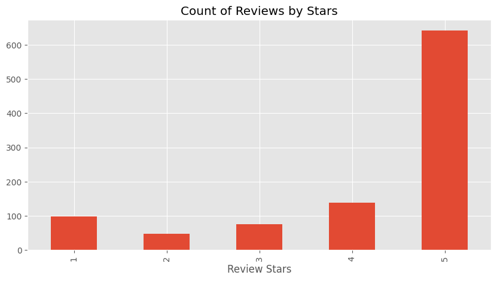
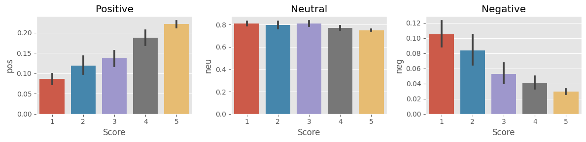
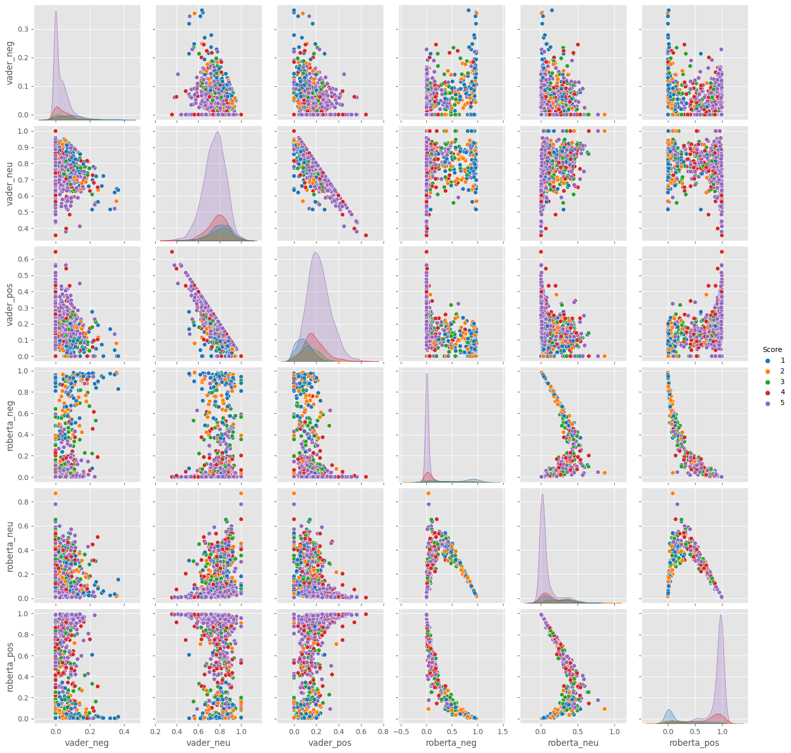

# Review Analyzer for Product Reviews Dataset

This project develops a review analyzer for a dataset containing product reviews, offering sentiment analysis and insights into review sentiment distribution. A similar approach can 

## Table of Contents
- [Features](#features)
- [Technologies Used](#technologies-used)
- [Usage](#usage)
- [Future Enhancements](#future-enhancements)
- [Contribution](#contribution)

## Features
- **Dataset Utilization**: Leverages a dataset containing product reviews for analysis, eliminating the need for web scraping.
- **Preprocessing**: Cleans and preprocesses the text data, including tasks such as lowercasing, tokenization, removing stopwords, and lemmatization.
- **Machine Learning**: Applies machine learning algorithms for sentiment analysis or review classification, enabling users to classify reviews into positive, negative, or neutral categories.
- **Scalability**: Designed to handle large volumes of review data efficiently, making it suitable for analyzing datasets with a high number of reviews.
- **Visualization**: Provides visualizations and summary statistics to help users understand the sentiment distribution of reviews in the dataset.

## Technologies Used
- Python
- NLTK for natural language processing
- Scikit-learn for machine learning
- Pandas and NumPy for data manipulation
- Matplotlib and Seaborn for data visualization

## Usage
1. Clone the repository to your local machine.
2. Install the required dependencies listed in the `requirements.txt` file.
3. Load your dataset containing product reviews into the project.
4. Run the main script to preprocess the data, perform sentiment analysis or review classification, and generate insights into the sentiment distribution of the reviews in the dataset.
5. Explore the results and visualizations generated by the analyzer.

## Result Snapshot

- **Count of review stars:**

- **Vader Subplots:**

- **Vader & Roberta pretrained model subplots:**

## Future Enhancements
- Integration with additional datasets or APIs to enrich the analysis with diverse review data.
- Development of a user-friendly interface for easy interaction and visualization of review insights.
- Incorporation of advanced natural language processing techniques to enhance sentiment analysis accuracy.

## Contribution
Contributions to the project are welcome! Feel free to submit bug fixes, feature enhancements, or suggestions through pull requests or by opening issues in the repository.
